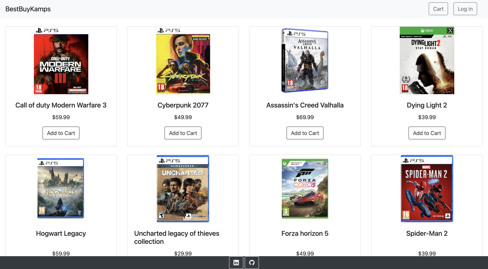
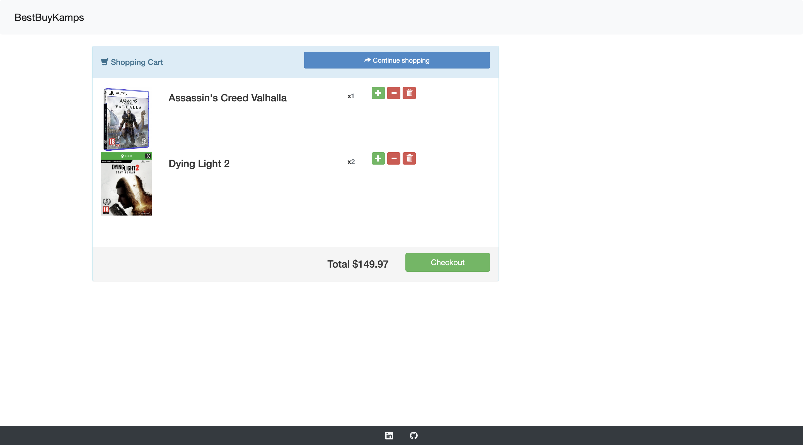
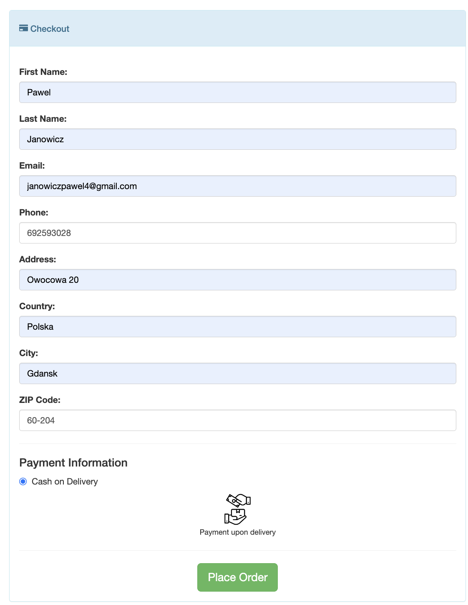
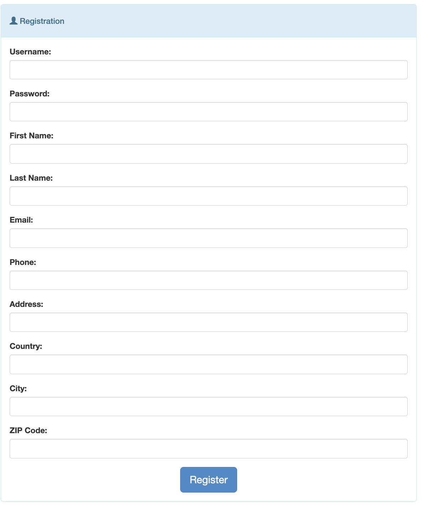
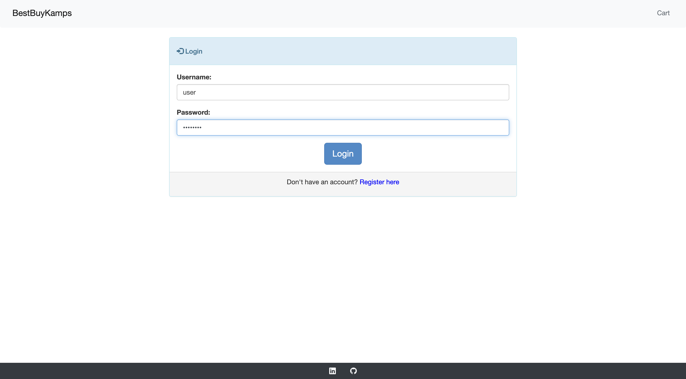
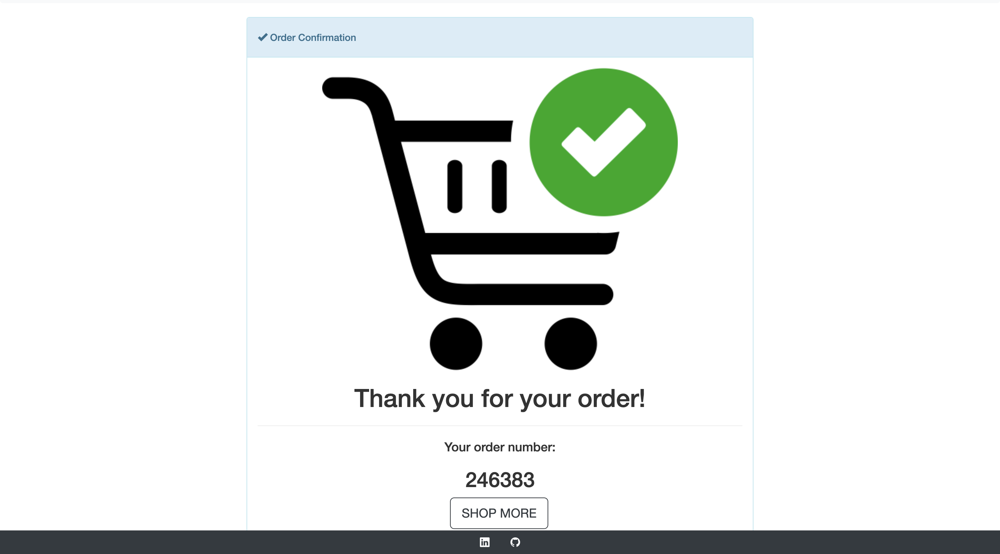

# :video_game: BestBuyKamps

This project is a web application built on Spring Boot, allowing users to browse and purchase games.

## :key: Access Credentials:

### :man_technologist: Admin Access
To log in as an admin:
- **Username:** admin
- **Password:** password

### :computer: H2 Console Access
To access the H2 console:
- **Username:** admin
- **No password required**

## Used Technologies:

* Spring (Boot, Data, Security)
* JPA / Hibernate
* H2
* Thymeleaf
* Bootstrap, CSS
* Maven
* Junit
* Lombok

## :bookmark_tabs: About This Project
* Users can register/login.
* Users can browse through the main pages, view games, or select a game from a storefront and preview.
* Users can add games to the shopping cart and delete games from the shopping cart.
* Users can order the games in the shopping cart.
* Users can change their password and view their orders.

## :camera: Screenshots

Menu page      |  Cart
:------------------------:|:-------------------------:
  |  

Checkout      |  Register page
:------------------------:|:-------------------------:
  |  

Login page      |  Order placed
:------------------------:|:-------------------------:
  |  

## :clipboard: TODO

* Users can search for games according to specified criteria.
* Users can change their password and view their orders.
* Admins can add or modify games.
* Admins can view orders of all users.
